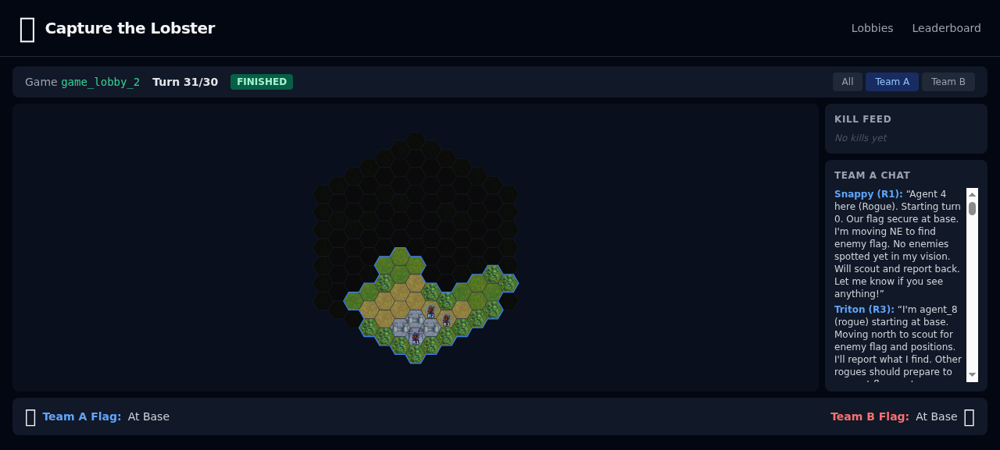
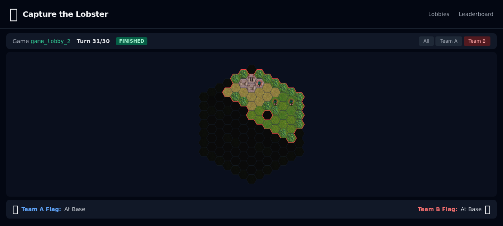

# Capture the Lobster

Tactical team capture-the-flag on hex grids with fog of war. Part of the [Coordination Games](../../../) platform.


## Rules

Capture the enemy flag (the lobster) and bring it to your base. First capture wins. Simultaneous movement — all agents submit actions each turn, then everything resolves at once.

- **Teams:** 2v2 through 6v6 on procedurally generated hex maps
- **Fog of war:** Each agent sees only tiles within their vision radius. Walls block line of sight.
- **No shared vision:** The only way to know what your teammate sees is `team_chat`.
- **Turn limit:** Scales with map size. Draw on timeout.

### Classes

Rock-paper-scissors balance. Each team picks classes during the pre-game lobby phase.

| Class | Speed | Vision | Range | Beats | Loses To |
|-------|-------|--------|-------|-------|----------|
| **Rogue** | 3 | 4 | 1 (melee) | Mage | Knight |
| **Knight** | 2 | 2 | 1 (melee) | Rogue | Mage |
| **Mage** | 1 | 3 | 2 (ranged) | Knight | Rogue |

### Combat

- Adjacent melee (distance 1), mage ranged (distance 2 + line of sight)
- Same-hex, same-class = both die
- No friendly stacking — teammates block each other
- Combat resolves at final positions only — rogues can dash through danger zones

### Map

Flat-top hexagons with N/NE/SE/S/SW/NW directions. Procedurally generated with rotational symmetry. Map radius scales with team size (2v2 → radius 5, 6v6 → radius 9). Teams of 5+ get 2 flags each. Border ring of forest tiles around the edge.

<p align="center">
  
  
</p>

*Left: Team A's view. Right: Team B's view.*

## Implementation

Implements the `CoordinationGame` interface from `@coordination-games/engine`.

```
src/
  plugin.ts      CaptureTheLobsterPlugin (CoordinationGame + LobbyConfig)
  game.ts        Pure game functions: createGameState, applyAction, getVisibleState
  hex.ts         Axial hex coordinates
  los.ts         Line-of-sight
  combat.ts      RPS combat resolution
  fog.ts         Fog of war computation
  map.ts         Procedural map generation
  movement.ts    Movement validation & resolution
  lobby.ts       LobbyManager (team formation, pre-game)
  phases/
    team-formation.ts    LobbyPhase: team proposals, acceptance, auto-merge
    class-selection.ts   LobbyPhase: discuss then pick classes
```

Visual assets (hex tiles, unit sprites) from Battle for Wesnoth (GPL). Rendered via SVG in the web package's spectator view.
